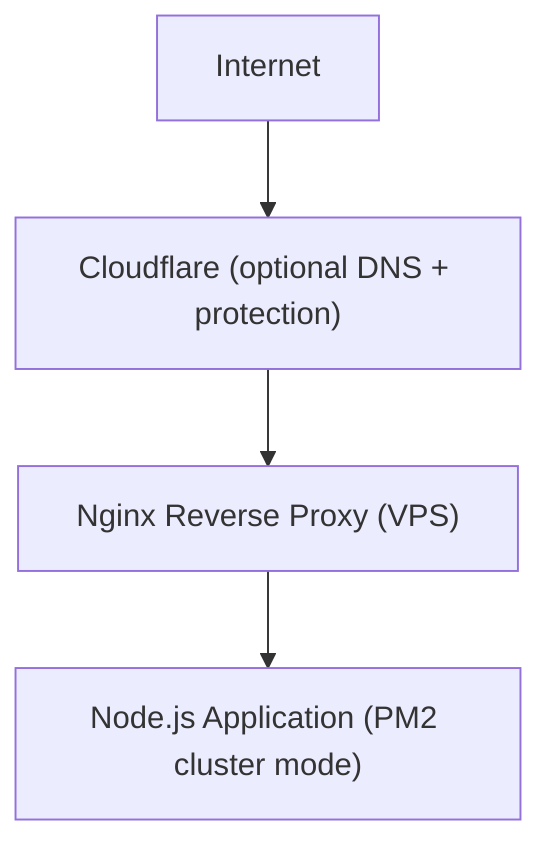

# DentalSaaS Technical Architecture & System Documentation

- **System Name:** DentalSaaS
- **Type:** Multi-Organization SaaS (B2B)
- **Architecture:** MERN Stack (MongoDB, Express, React, Node.js)
- **Deployment:** Enterprise-Grade Cloud Node Environment
- **Document Version:** v1.3.5
- **Architecture Status:** Production-Ready (Enterprise Multi-Tenant + Hardened Superadmin Security)
- **Last Updated:** 2026-02-25

---

## 1. PROJECT OVERVIEW
DentalSaaS is a cloud-native, multi-organization practice management platform designed for dental clinics. The system enforces strict tenant isolation while enabling centralized governance through a Platform Administration layer.

**Core goals:**
- Strong multi-tenant isolation
- Enterprise-grade authentication
- Subscription-aware feature gating
- Cryptographically verifiable audit trails
- Horizontally scalable backend architecture
- Stripe-authoritative billing lifecycle

---

## 2. SYSTEM ARCHITECTURE OVERVIEW
DentalSaaS follows a decoupled SPA + REST API architecture:

- **Frontend:**
  - React (Vite)
  - Tailwind CSS
  - Axios with interceptors
  - In-memory token storage
- **Backend:**
  - Node.js
  - Express
  - MongoDB
  - Mongoose ODM

### 2.1 Layer Separation
The system is strictly partitioned into three layers:

1) **Public Layer**
   - Unauthenticated:
     - Landing pages
     - Signup
     - Marketing content

2) **Platform Layer**
   - Authenticated via PlatformUser tokens:
     - Organization provisioning
     - Subscription governance
     - Feature definitions
     - Revenue analytics
     - Audit verification

3) **Organization Layer**
   - Authenticated via User tokens:
     - Patients
     - Appointments
     - Billing
     - Branch management
     - Internal audit logs

Platform and Organization layers are cryptographically separated via token type.

---

## 3. MULTI-TENANCY STRATEGY
DentalSaaS uses Logical Isolation (Shared DB, Shared Schema).
Each organization is cryptographically isolated at the application layer. Cross-tenant queries are structurally impossible without JWT compromise.

**All operational data includes:**
Copy code
```
organizationId
```

**Isolation enforcement rules:**
- `organizationId` is derived strictly from verified JWT
- No hostname resolution
- No subdomain fallback
- No client-provided `organizationId` accepted
- Controllers never trust `req.body.organizationId`
- Tenant identity is derived exclusively from a cryptographically verified JWT. No headers, hostname, query parameters, or client-supplied identifiers influence tenant resolution.

### 3.1 Slug-Based Login Model
Subdomain resolution has been fully removed.

**Users authenticate using:**
- `clinicCode` (Organization.slug)
- `email`
- `password`

**Flow:**
- `authController` resolves organization via slug
- JWT embeds `organizationId`
- All future requests rely only on JWT payload
- 

*System is fully hostname-agnostic.*

---

## 4. DATABASE ARCHITECTURE

### 4.1 Primary Entities
- Organization
- PlatformUser
- User
- Role
- SubscriptionHistory
- RefreshToken
- AuditLog
- PlatformAuditLog
- Patient
- Appointment

**All collections are indexed for:**
- `organizationId`
- `createdAt`
- search fields
- billing linkage

### 4.2 Soft Delete Enforcement
**All operational models use:**
Copy code
```javascript
isActive: Boolean
deletedAt: Date
```
*Hard deletions are prohibited.*

---

## 5. ENTERPRISE AUTHENTICATION ARCHITECTURE (v1.2)
DentalSaaS implements a dual-layer security model.

### 5.1 Layer 1 — Access Tokens
- **Expiration:** 15 minutes
- **Stored in memory only**
- **Persistence:** Never stored in localStorage
- **Transport:** Included in Authorization header
- **Verification:** Validated on every request

**JWT Payload:**
Copy code
```json
{
  "userId": "string",
  "organizationId": "string",
  "tokenVersion": "number",
  "type": "org" | "platform"
}
```

**Global Invalidation (Kill Switch)**
- If `tokenVersion` mismatch:
  - Immediate logout
  - All sessions invalid

**Triggered by:**
- Password change
- Account suspension
- Reuse detection
- Revoke-all action

### 5.2 Layer 2 — Refresh Token Rotation
**Refresh tokens:**
- Stored hashed in DB
- Sent via HTTP-only cookie
- Secure in production
- SameSite=Strict
- Path restricted to `/api/auth`

#### 5.2.1 Refresh Token Cookie Security Flags

Refresh tokens are issued using strict cookie security configuration:

- **HttpOnly** → Not accessible via JavaScript (prevents XSS token theft)
- **Secure** → Sent only over HTTPS in production
- **SameSite=Strict** → Prevents cross-site request forgery
- **Path=/api/auth** → Cookie only sent to authentication routes
- **Max-Age** → Explicit expiration aligned with refresh lifespan

These flags are enforced at the server level during cookie issuance.

**Rotation Logic**
Each refresh request:
- Revokes old refresh token
- Issues new token
- Updates `lastUsedAt`

### 5.3 Session Controls
- Maximum 5 active sessions per user
- Oldest session revoked automatically

**Metadata stored:**
- IP address
- User agent
- `lastUsedAt`

### 5.4 Reuse Detection
- If revoked refresh token is reused and not replaced:
  - All refresh tokens revoked
  - `tokenVersion++`
  - Global logout executed

*This mitigates session theft persistence.*

### 5.5 CSRF Protection (v1.2)
Refresh endpoint uses Double Submit Cookie pattern.

**Mechanism:**
- `csrf_token` cookie (non-httpOnly)
- `x-csrf-token` header required
- Backend validates match before refresh logic

**Applied only to:**
- `/api/auth/refresh`
- Session revoke endpoints
*Not applied to login or public routes.*

### 5.6 Superadmin Credential Protection (v1.3.5)

**Rule:** Only a superadmin can manage credentials (password, email, MFA) for another superadmin.

**Enforcement:**
- Platform API routes check `isSuperAdmin` flag
- If target user is superadmin and actor is not superadmin → 403 Forbidden
- Protected endpoints:
  - `PUT /api/platform/users/:userId`
  - `PATCH /api/platform/users/:userId/status`
  - `PATCH /api/platform/users/:userId/role`
  - `PATCH /api/platform/users/:userId/mfa`

**Scope:** Applies to both `PlatformUser` and `User` models when target is superadmin.

### 5.6.1 Mandatory TOTP-Based 2FA
**All platformRole === "superadmin" accounts must use Time-Based One-Time Password (TOTP) authentication.**

**Properties:**
- 6-digit TOTP codes
- 30-second window
- Speakeasy implementation
- QR-based onboarding
**Login Flow:**
- Email + Password validation
- If superadmin → return requires2FA: true
- Verify TOTP
- Issue access + refresh tokens

### 5.6.2 AES-256 Encrypted TOTP Secret Storage
**Superadmin TOTP secrets are encrypted at rest.**

**Encryption Model:**
- AES-256-GCM
- Random IV per encryption
- Auth tag verification
- Base64 encoded storage
**Secret decrypted only in memory**
**Environment Variable:**
Copy code

TOTP_ENCRYPTION_KEY
**TOTP_ENCRYPTION_KEY must be:**
- 64-character high-entropy hex
- Stored only in environment variables
- Never committed to source control
- Rotated only through controlled migration process
- Loss of this key renders existing TOTP secrets unrecoverable.
**Key rotation requires:**
- Forced 2FA reset for all superadmins
- Audit event logging
- Controlled downtime window
**Secrets are never stored in plain text.**

### 5.6.3 Recovery Code System
**Each superadmin receives 10 one-time recovery codes during 2FA setup.**
**Recovery codes are hashed before storage**
**Each code is single-use**
**Using a recovery code triggers:**
- Immediate tokenVersion increment
- Audit log entry
- Security alert
- Mark code as used
**Recovery codes cannot be regenerated without TOTP verification.**

### 5.6.4 Failed 2FA Lockout System (v1.3.5)
**Superadmin 2FA attempts are monitored.**
**Fields added:**
- failed2FAAttempts
- lastFailed2FAAt
- twoFALockedUntil
**Rules:**
- 5 failed attempts within 10 minutes → 15 minute lock
- Locked state returns HTTP 423
- Successful verification resets counters
- Lock events logged and alert-triggered

### 5.6.5 IP Anomaly Detection
**Superadmin logins are evaluated against known trusted IPs.**
**Model:**
- Copy code

trustedIPs: [
  { ip, lastUsedAt }
]
**Rules:**
- New IP triggers anomaly detection
- Audit event logged
- Security alert triggered
- Trusted IP list capped at last 10 entries

### 5.6.6 Automatic Security Alerts
**Security events trigger alerts:**
- New IP login
- Recovery code usage
- Excessive failed 2FA attempts
- 2FA disable attempt
- Superadmin role change attempt
**Alerts include:**
- Timestamp
- IP address
- User agent
- Action performed
**Email delivery failures do not block login.**

### 5.6.7 Superadmin Immutability Enforcement
**System guarantees:**
- Last superadmin cannot be deleted
- Last superadmin cannot be downgraded
- 2FA cannot be disabled if only one superadmin remains
**These checks occur at application logic level before persistence.**

### 5.6.8 Development Mode Safety Override
**Development environment supports controlled bypass for productivity.**
**Environment Variable:**
Copy code

ALLOW_SUPERADMIN_DEV_BYPASS=true
**Rules:**
- Only valid when NODE_ENV === "development"
- Accepts fixed TOTP code: 000000
- Fully logged (DEV_BYPASS_USED)
- Does NOT bypass:
  - Password check
  - tokenVersion
  - Refresh rotation
- User active checks
- System crashes on startup if bypass enabled in production.
---

## 6. STRIPE PRODUCTION BILLING ARCHITECTURE (v1.3)
Stripe acts as authoritative billing provider.

### 6.1 Billing Identifiers
**Organization stores:**
- `stripeCustomerId`
- `stripeSubscriptionId`

**Stripe is source of truth for:**
- Payment state
- Renewal
- Cancellation
- Plan upgrades
- Invoice failures

### 6.2 Subscription Lifecycle
- **Trial (14 Days)**
  - Organization created
  - Trial tier activated
  - `trialEndsAt` set

- **Upgrade Flow**
  - Checkout session created
  - Stripe processes payment
  - Webhook validates event
  - Subscription updated
  - `applyPlanFeatures()` executed

### 6.3 Webhook Endpoint
Copy code
```javascript
POST /api/webhooks/stripe
```

**Validates:**
- Stripe signature
- Event authenticity

**Supported events:**
- `invoice.paid`
- `invoice.payment_failed`
- `customer.subscription.updated`
- `customer.subscription.deleted`

### 6.4 Grace Period Handling
If payment fails:
1. Enter grace period
2. Email warnings triggered
3. After grace expiration:
   - `subscription.status = suspended`
   - `requireFeature` blocks API access

---

## 7. FEATURE ENGINE
**FeatureDefinition defines:**
- key
- allowedPlans
- isCore
- defaultEnabled

**Organization.features map stores:**
- enabled
- overridden

**Middleware:**
Copy code
```javascript
requireFeature("featureKey")
```
*Blocks unauthorized API access.*

---

## 8. TAMPER-EVIDENT AUDIT LOGS (v1.2.1)
Audit logs are cryptographically chained.

**Each log includes:**
- `previousHash`
- `hash`
- `signatureVersion`

**Audit Log Schema:**
```javascript
{
  _id: ObjectId,
  organizationId: ObjectId,
  actorId: ObjectId,
  action: String,          // e.g., "PATIENT_CREATED"
  entityType: String,      // e.g., "PATIENT"
  entityId: ObjectId,
  metadata: Object,        // e.g., { name: "John Doe" }
  timestamp: Date,
  previousHash: String,    // HMAC of previous log
  hash: String,            // HMAC of this log
  signatureVersion: String // "v1.2.1"
}
```

### 8.1 Hash Generation
HMAC SHA256 using:
Copy code
```javascript
AUDIT_SECRET
```

**Input includes:**
- action
- actorId
- organizationId
- entityType
- entityId
- timestamp
- previousHash

*Chain is per organization.*
*Platform logs use separate global chain.*

### 8.2 Verification Service
**Manual verification endpoint:**
Copy code
```javascript
verifyOrganizationAuditChain(organizationId)
```

**Detects:**
- Chain breaks
- Hash mismatches
- Tampering attempts

### 8.3 Audit Storage Integrity Controls

Audit logs are strictly append-only.

- No update operations are permitted on existing audit records.
- Deletion of audit records is prohibited under normal system operation.
- Direct database modification breaks chain verification.
- Any manual alteration invalidates the HMAC chain integrity.

The verification service must operate using read-only database privileges.

Audit log verification must never execute with write access to audit collections.

This guarantees tamper detection even in the event of database-level compromise.

---

## 9. PLATFORM SEARCH ENGINE
- Prefix-anchored regex
- Escaped inputs
- Indexed fields
- Limited results per category
- Parallelized `Promise.all` queries

---

## 10. INFRASTRUCTURE & SCALING
- Distributed cron locks
- Atomic Mongo locks
- Graceful shutdown handling
- Stateless API design
- Local `/uploads` pending S3 migration
- Horizontal scaling safe

---

## 11. KNOWN CONSTRAINTS
- No subdomain-based tenant resolution.
- No hostname fallback.
- JWT is sole tenant identity source.
- No API version prefix yet.
- Local file storage not horizontally scalable. Will be replaced with S3 in the future.
- Real-time notifications are polling-based.

---

## 12. VERSION HISTORY

| Version | Major Upgrade |
| :--- | :--- |
| v1.0.0-alpha | Slug-based multi-tenant |
| v1.1.0 | Dual-layer authentication |
| v1.2.0 | CSRF protection |
| v1.2.1 | Signed audit logs |
| v1.3.0 | Stripe production billing |
| v1.3.4 | Superadmin 2FA + Encryption + Alerts |
| v1.3.5 | Failed 2FA lockout + IP anomaly detection + Dev safety |
---

## 13. CURRENT ARCHITECTURAL MATURITY
- DentalSaaS now includes:
- Slug-based tenant resolution
- Stateless JWT isolation
- Dual-layer authentication
- Refresh token rotation
- Reuse detection kill-switch
- CSRF hardened refresh endpoint
- Device-level session management
- Tamper-evident signed audit logs
- Stripe-authoritative billing
- Feature gating engine
- Distributed cron locking
- Soft delete enforcement
- AES-encrypted TOTP secrets
- Recovery code system
- Superadmin immutability
- IP anomaly detection
- Failed 2FA lockout system
- Automated security alerting
- Development-safe bypass with production guard
- Architecture Tier:
- Hardened Enterprise SaaS – Owner-Level Security & Stripe-Grade Billing

**Architecture Tier:**
**Enterprise SaaS-Grade Security & Billing Ready**

---

## 14. PRODUCTION DEPLOYMENT ARCHITECTURE (Future update)
DentalSaaS is designed to support a cost-efficient initial deployment while remaining horizontally scalable in future phases.

The production deployment model separates:
- Compute Layer
- Database Layer
- Object Storage Layer
- Networking & Security Layer
- Observability & Backup Layer

This ensures clean responsibility boundaries and future upgrade paths.

### 14.1 Compute Layer (Backend API)
**Recommended Initial Deployment Model**
- **Provider:** Hetzner VPS (recommended for cost efficiency) OR DigitalOcean Droplet
- **Server Specification (Early Stage Production):**
  - 2 vCPU
  - 4GB RAM
  - Ubuntu 22.04 LTS
- **Runtime Environment:**
  - Node.js LTS
  - PM2 process manager
  - Nginx reverse proxy
  - HTTPS via Let’s Encrypt

**Process Architecture**


**PM2 ensures:**
- Auto-restart on crash
- Zero-downtime reloads
- Log management

### 14.2 Database Layer
**MongoDB Atlas (Managed)**
DentalSaaS uses MongoDB Atlas as the managed database provider.

**Benefits:**
- Automatic backups
- TLS-enforced connections
- IP access control
- Built-in monitoring
- Replica set redundancy

**Recommended Tier (Early Production):**
- M0 (development)
- M2/M5 (small production)

**Security Controls:**
- Whitelisted VPS IP only
- Database users with least privilege
- TLS required
- Encrypted at rest

### 14.3 Object Storage Layer (S3)
Local `/uploads` storage is deprecated for production use.

**DentalSaaS uses:**
- **AWS S3 (Primary Object Storage)**

**Usage:**
- Patient X-rays
- Intraoral photos
- Lab files
- Attachments
- Future STL / imaging files

**S3 Configuration Model:**
- Private bucket
- No public ACLs
- Server-side encryption enabled
- Versioning enabled (optional but recommended)
- Lifecycle rules configurable

**Upload Flow:**
1. Backend generates pre-signed upload URL
2. Frontend uploads directly to S3
3. Backend stores object key in MongoDB
4. Access controlled via signed URLs

**This ensures:**
- No file storage on VPS
- Horizontal scaling compatibility
- Reduced backend load
- Secure file delivery

### 14.4 CDN Layer (Future Optimization)
Optional but recommended at scale: **AWS CloudFront**

**Used for:**
- Global caching
- Faster file delivery
- Signed URLs
- WAF integration

**This layer becomes relevant when:**
- Clinics span multiple geographic regions
- Image delivery volume increases

### 14.5 Networking & Domain Configuration
**Recommended Domain Structure:**
- `app.yourdomain.com` → Frontend
- `api.yourdomain.com` → Backend API

**DNS Provider:**
- Cloudflare (recommended) OR Domain registrar DNS

**Cloudflare Benefits (Optional):**
- DDoS protection
- DNS management
- SSL termination
- Basic WAF

### 14.6 Security Hardening
**VPS Hardening Checklist:**
- SSH key login only
- Disable root password login
- Fail2Ban installed
- UFW firewall enabled (Only ports 22, 80, 443 open)
- Environment variables stored in `.env`
- No secrets committed to Git

**Backend Security:**
- HTTPS enforced
- Helmet headers enabled
- Rate limiting enabled
- Mongo sanitize enabled
- CSRF protection for refresh endpoint
- Signed audit logs

### 14.7 Backup & Recovery Strategy
- **Database:** MongoDB Atlas automated backups
- **Object Storage:** S3 versioning enabled (Optional cross-region replication)
- **Application:** Git-based source control, Tagged releases, PM2 ecosystem configuration
- **Disaster Recovery:** 
    Estimated RPO: < 24 hours (Atlas backup schedule)
Estimated RTO: < 2 hours (VPS rebuild + restore)
### 14.8 Horizontal Scaling Path (Future)
When traffic increases:

- **Phase 1 Upgrade:** Upgrade VPS resources
- **Phase 2 Upgrade:**
  - Move backend to AWS ECS or Kubernetes
  - Introduce load balancer
  - Introduce Redis cache
  - Enable CloudFront CDN
  - Configure S3 lifecycle policies

**This path requires no architectural refactor because:**
- Application is stateless
- Tenant identity is JWT-based
- File storage is externalized
- Cron locks are distributed-safe

### 14.9 Cost Efficiency Model
**Estimated Early Stage Monthly Cost:**

| Component | Estimated Cost |
| :--- | :--- |
| VPS | $10–25 |
| MongoDB Atlas | $9–25 |
| AWS S3 | $2–15 |
| Domain + DNS | $5–10 |
| **Total Estimated Monthly Cost** | **~$30–70 depending on usage** |

*This allows professional SaaS deployment without enterprise cloud overhead.*

### 14.10 Architectural Alignment
This deployment strategy is fully compatible with:
- Slug-based tenant resolution
- Dual-layer authentication
- CSRF protection
- Signed audit logs
- Stripe billing integration
- Multi-tenant isolation

*No architectural refactoring is required when upgrading infrastructure layers.*

---

## 15. SECURITY MODEL SUMMARY
DentalSaaS adopts a **Defense-in-Depth** security model, ensuring multi-layer protection across all data boundaries.

### 15.1 Zero-Trust Request Model
- **Verification First**: Every request to a protected route undergoes mandatory authentication and authorization check.
- **Tenant Isolation**: `organizationId` is never trusted from client input. It is strictly extracted from verified JWT claims.
- **Least Privilege**: API keys and service tokens (e.g., Stripe) are restricted to the minimum required scopes.

### 15.2 Authentication & Session Hardening
- **Signature Verification**: All JWTs are signed using a high-entropy `JWT_SECRET`.
- **Token Version Enforcement**: Global invalidation of all sessions via `tokenVersion` increment on security events (password change, suspension).
- **Rotation Enforcement**: Refresh tokens are rotated on every use; reuse detection triggers immediate global logout.
- **CSRF Protection**: Critical endpoints (Refresh, Revoke) require a Double Submit Cookie match (header vs cookie).

### 15.2.1 Rate Limiting & Brute Force Protection
**DentalSaaS enforces strict rate limiting at authentication and high-risk endpoints.**
**Protected Endpoints:**
- /api/auth/login
- /api/auth/refresh
- /api/platform/login
- /api/platform/2fa/verify
- /api/platform/2fa/disable
**Policies:**
- **Production**: 5 attempts per 5 minutes
- **Development**: 10 attempts per 5 minutes
- **Lockout responses use HTTP 429 (Too Many Requests)**
- **2FA lockouts use HTTP 423 (Locked)**
- **This prevents credential stuffing and TOTP brute-force attacks.**

### 15.3 Data & Logic Integrity
- **Password Safety**: Raw passwords are never stored or logged. One-way hashing with `bcrypt` (12+ salt rounds) is mandatory.
- **Audit Tamper Detection**: Logs are cryptographically chained (HMAC SHA-256); any local or unauthorized modification breaks the chain.
- **Webhook Authenticity**: Stripe webhooks require valid signature verification using the `STRIPE_WEBHOOK_SECRET`.

*This consolidated posture ensures that DentalSaaS is resilient against session theft, cross-tenant leaks, and infrastructure-level tampering.*

### 15.4 Superadmin Risk Model
**Superadmin accounts represent system ownership and therefore are subject to:**
- Mandatory TOTP
- Encrypted secret storage
- Lockout enforcement
- IP anomaly detection
- Recovery code enforcement
- Immutability rules
- Elevated audit tracking
This establishes a strict security boundary between operational administrators and system ownership.

### 15.5 Logging & Observability Policy

DentalSaaS uses structured JSON logging to ensure observability without compromising sensitive data.

#### Logging Rules:

- Passwords are never logged.
- TOTP codes are never logged.
- Raw access tokens are never logged.
- Raw refresh tokens are never logged.
- Stripe secrets are never logged.
- PII fields are minimized in logs.
- Error stacks are sanitized in production.

#### Logging Format:

- Structured JSON logs
- Includes timestamp, service, action, requestId
- Correlation IDs supported for tracing

Logs are intended for monitoring, debugging, and forensic analysis only.

## 16. ENVIRONMENT VARIABLE GOVERNANCE

DentalSaaS relies on high-entropy environment variables for cryptographic integrity and third-party integrations.

### 16.1 Required Security Secrets

- **JWT_SECRET**
  - Minimum 64-character high-entropy string
  - Used for signing access tokens

- **TOTP_ENCRYPTION_KEY**
  - 32-byte key (64-character hex)
  - Used for AES-256-GCM encryption of TOTP secrets

- **AUDIT_SECRET**
  - Used for HMAC-based audit chain signing

- **STRIPE_SECRET_KEY**
  - Stripe API authentication

- **STRIPE_WEBHOOK_SECRET**
  - Stripe webhook signature verification

- **NODE_ENV**
  - Controls production vs development behavior

- **ALLOW_SUPERADMIN_DEV_BYPASS**
  - Development-only feature flag
  - System crashes if enabled in production

All cryptographic secrets must be generated using CSPRNG.
Minimum entropy: 256 bits.
Example generation:
```
node -e "console.log(require('crypto').randomBytes(32).toString('hex'))"
```
---

### 16.2 Governance Rules

- Secrets must never be committed to source control.
- Secrets must not be logged.
- Secrets must not be shared in client-side code.
- Production secrets must differ from development secrets.
- Secret rotation requires controlled deployment process.

Compromise of cryptographic keys requires immediate token invalidation and key rotation procedure.

## 17. DATA RETENTION & DATA LIFECYCLE POLICY
- DentalSaaS implements structured data retention and lifecycle controls to ensure legal compliance, operational efficiency, and data minimization.
**The system distinguishes between:**
- Operational Clinical Data
- Billing & Financial Records
- Authentication & Security Logs
- Audit Trails
- Backup Data

### 17.1 Clinical & Patient Data
- Clinical data (patients, appointments, treatment history, medical records):
- Retained indefinitely while organization subscription is active.
**Upon organization suspension:**
- Data remains stored but access is restricted.
**Upon organization termination:**
- Data retained for 30 days (configurable grace window).
**After retention window, permanent deletion may occur upon explicit request.**
- Soft delete is enforced at the application layer:
JavaScript
Copy code
isActive: false
deletedAt: Date
- Hard deletion is reserved for controlled cleanup operations only.

### 17.2 Billing & Financial Records
- Billing records, invoices, and Stripe references:
- Retained for minimum 7 years (recommended financial compliance standard).
- Stripe acts as authoritative financial record.
- SubscriptionHistory remains immutable and auditable.
- Financial records are never automatically purged.

### 17.3 Audit Logs
- Audit logs are tamper-evident and cryptographically chained.
- Retention policy:
- Minimum retention: 1 year
- Recommended retention: 3–7 years
- Logs may be archived but not modified
- Deleting audit logs requires manual, controlled administrative action
Platform-level logs are isolated from organization logs.

### 17.4 Authentication & Security Logs
- Includes:
- Login attempts
- Failed 2FA attempts
- Lockout events
- IP anomaly events
- Token revocation events
**Retention policy:**
- Retained minimum 90 days
- High-risk events retained 1 year
- Used for forensic investigation and anomaly detection

### 17.5 Refresh Tokens & Sessions
**Refresh tokens:**
- Stored hashed
- Automatically revoked on rotation
- Expire after defined period (e.g., 7 days)
- Revoked tokens may be cleaned after expiration
**Active session metadata retained until:**
- Session revoked
- Expiration reached
- Account disabled

### 17.6 Backups
**MongoDB Atlas automated backups:**
- Retention based on Atlas tier configuration
- Default: daily snapshots
- Backup retention window configurable
**S3 object storage:**
- Optional versioning enabled
- Lifecycle rules may archive to cold storage
- Cross-region replication optional
- Estimated RPO: < 24 hours
- Estimated RTO: < 2 hours

### 17.7 Data Deletion & Right to Erasure
**Organizations may request:**
- Full data export
- Permanent deletion of organization data
**Deletion process includes:**
- Soft delete
- 30-day cooling period
  - Hard delete confirmation
- Removal from backups on natural expiration cycle
- Deletion events are audit logged.

### 17.8 Development & Test Data
**Development environments:**
- Must not contain real patient data. 
- Dev bypass mechanisms are logged.
- Local development data is non-production and may be reset at any time.

### 17.9 Data Minimization Principle
**DentalSaaS adheres to the principle of minimum necessary data:**
- No unnecessary PII collected.
- No plaintext credential storage.
- Secrets stored encrypted or hashed.
- Logs exclude sensitive raw payloads.

### 18. INCIDENT RESPONSE & BREACH HANDLING POLICY
**Include:**

#### 18.1 Detection
**Automated alerts for:**
- 2FA abuse
- Token reuse detection
- Suspicious login patterns
- Stripe webhook failures
**Centralized logging via structured logger**

#### 18.2 Containment
- Immediate tokenVersion++ for compromised account
- Forced logout
- Superadmin alert escalation
- IP blocking if required

#### 18.3 Investigation
**Review:**
- AuditLog chain
- Authentication logs
- IP anomaly records
- Forensic analysis retained
  
#### 18.4 Notification
**Organization notified within defined SLA**
Stripe notified if billing impact
Internal documentation recorded
**Security incidents are classified into Severity Levels:**
- **SEV1 (Critical):** Immediate service compromise – Notification within 24 hours
- **SEV2 (High):** Potential data exposure – Notification within 48 hours
- **SEV3 (Low):** Minor security event – Internal documentation only

#### 18.5 Post-Incident Hardening
- Secret rotation
- Forced password reset
- Rate limit tightening if necessary
- Patch deployment

### 19. THREAT MODEL & ATTACK SURFACE ANALYSIS

#### 19.1 Major Threat Categories
| Threat | Mitigation |
|--------|------------|
| JWT Theft | Short expiry + rotation |
| Refresh Token Theft | Rotation + reuse detection |
| CSRF | Double Submit Cookie |
| Brute Force | Rate limiting |
| 2FA Brute Force | Lockout + time window |
| Insider Admin Abuse | Audit chaining |
| Cross-Tenant Data Leak | JWT-derived orgId only |
| Billing Manipulation | Stripe authoritative |
| Superadmin Takeover | Mandatory TOTP + encrypted secret |
| Infrastructure Compromise | Atlas + TLS + IP whitelist |

#### 19.2 Assumptions
- JWT_SECRET remains confidential
- TOTP_ENCRYPTION_KEY remains secure
- Stripe webhook secret not leaked
- MongoDB Atlas not compromised

### 20. API VERSIONING STRATEGY (Future)
**Current state:** unversioned /api
**Planned strategy:** /api/v1
**Breaking changes require version increment**
**Old versions sunset with 90-day deprecation notice**
**Swagger documentation version-tagged**