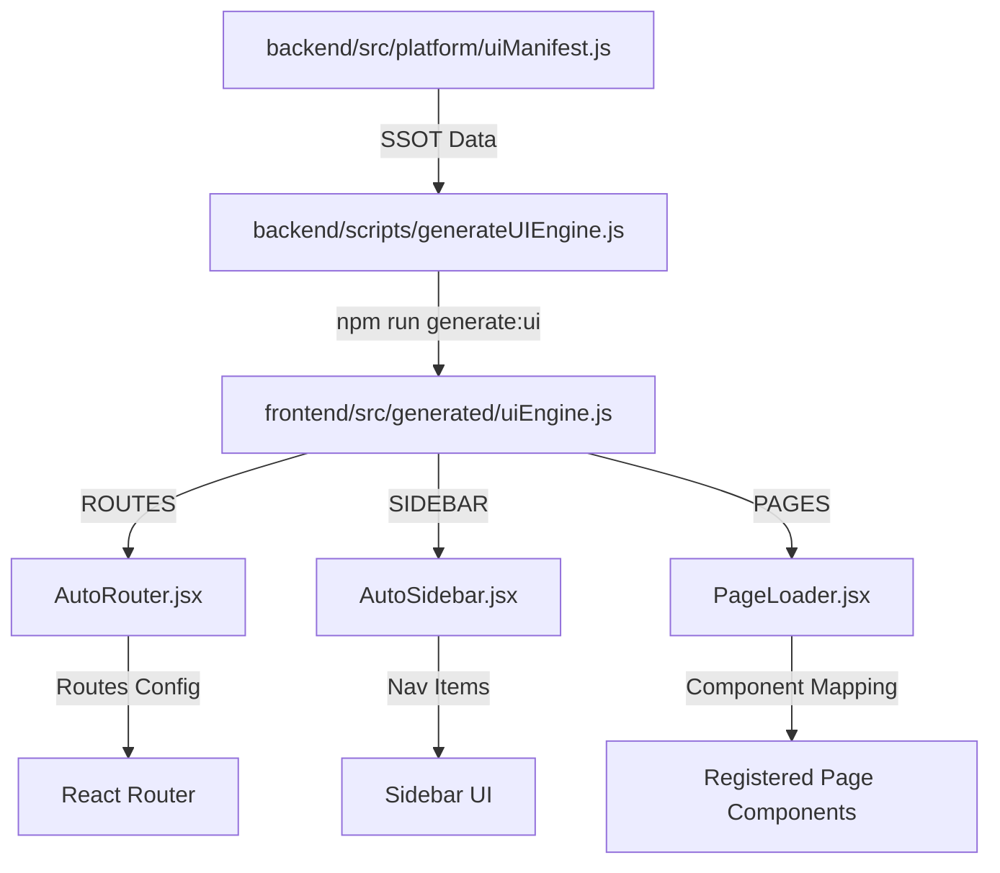

# 🧬 Full Auto UI Engine (v1.0)

> **The Single Source of Truth implementation for organization-plane navigation, routing, and access control.**
> *Backend defines → Frontend renders.*

---

## 🏛️ Overview

The **Full Auto UI Engine** is a spec-driven generation system that synchronizes backend module metadata from the `featureRegistry` (via `uiManifest.js`) into the frontend's routing and sidebar components. This eliminates the risk of "Route Drift" and ensures that security guards (RBAC + Entitlement) are applied deterministically at build-time.

---

## 🧠 Architecture



### Key Components

| Component | Responsibility | Guard Layer |
|-----------|----------------|-------------|
| **uiManifest.js** | Pure-data definition of all routes, icons, and permissions. | Manifest Constraint |
| **AutoRouter.jsx** | Dynamically mounts `<Route>` elements with consistent layouts. | `OrgPermissionGuard` |
| **AutoSidebar.jsx** | Generates the navigation menu with plan-level visibility filtering. | `useCapability` |
| **PageLoader.jsx** | Resolves high-level string names (e.g., `"PatientsTable"`) to React components. | Registry Validation |
| **validateUISync.js** | CI script that prevents merging if the artifact drifts from the manifest. | CI/CD Enforcement |

---

## 🔐 Zero-Trust Enforcement

The engine enforces two independent security layers for every route:
1. **Capability Layer (RBAC)**: Checks if the user's role has the required permission (e.g., `patients.read`).
2. **Entitlement Layer (SAAS)**: Checks if the organization's current plan (Essential, Pro, Enterprise) includes the module (e.g., `accounting`).

If a user navigates to a route they don't have permission for, the `OrgPermissionGuard` will:
- Redirect to a "Permission Denied" page (or the dashboard).
- Log a security violation attempt.

---

## 🛠️ Developer Workflow (Adding a Module)

Adding a new module now follows a strictly defined path:

1. **Backend Manifest**:
   - Add the module and its UI metadata to `backend/src/platform/uiManifest.js`.
   ```javascript
   {
     key: "inventory",
     module: "inventory",
     ui: { label: "Inventory", icon: "cube", route: "inventory", page: "InventoryPage" }
   }
   ```

2. **Frontend Registry**:
   - Create your page component in `frontend/src/pages/org/`.
   - Export it from `frontend/src/pages/org/index.js` using the name defined in the manifest.

3. **Synchronize**:
   - Run `npm run generate:ui` to refresh the frontend constants.
   - The route and sidebar item will appear automatically.

---

## 🛡️ Invariants
- **No manual routes** for organization modules.
- **Icon matching**: Icons are strings matching `@heroicons/react/24/outline` names.
- **Fail-Closed**: Routes with missing page components render a "Module Setup Error" instead of crashing.

---

## 🔗 Related Docs
- [[PlaneArchitecture|Architecture Overview]]
- [[RBAC|Security Framework]]
- [[EntitlementSystem|SaaS Quotas & Feature Gating]]

#front-end #architecture #ssot #codegen
