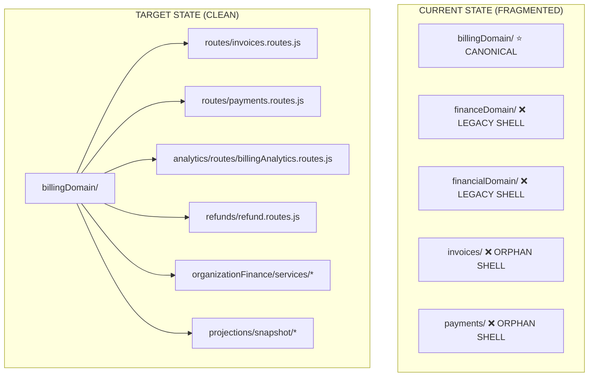

# 🛡️ ORG FINANCE DOMAIN AUDIT — ZERO-TRUST + DOMAIN-DRIVEN (v1.0)

> **Status**: AUDIT COMPLETE — **6 VIOLATIONS FOUND**  
> **Plane**: Organization  
> **Architecture**: Modular Monolith — DB-per-Tenant  
> **Risk Level**: 🟡 MEDIUM (no security breach, but significant architectural debt)  

---

## 📊 Executive Summary

The Org Finance system has **correct security enforcement** (RBAC, entitlements, audit) but suffers from **severe domain fragmentation**. What should be 1–2 clean bounded contexts is scattered across **5 separate directories** with **3 redundant naming conventions** and **2 duplicate route files**.



---

## ❌ VIOLATION REPORT

### V1 — FAKE DOMAIN DETECTION

| Domain Name | Status | Evidence |
|---|---|---|
| `finance` | 🟡 **PARTIALLY FAKE** | Used as entitlement key in `featureRegistry.js` (line 204) and as `module` for invoices/payments. Not a real domain — it's an **entitlement umbrella** that should map to `invoices` + `payments` + `accounting` individually. |
| `billing` | 🔴 **FAKE PERMISSION** | `P.BILLING_READ = "billing.read"` exists in `orgPermissions.js:109` and is used in `billingAnalytics.routes.js` — but "billing" is NOT a domain. It duplicates `accounting.read`. |
| `accounting` | ✅ **VALID** | `P.ACCOUNTING_READ` through `P.ACCOUNTING_DELETE` properly defined. Used correctly in `finance.routes.js` (financeDomain) for analytics endpoints. |

**Key Finding**: Two different route files serve the **exact same analytics endpoints** with **different permission constants**:

| File | Route | Permission Used |
|---|---|---|
| `financeDomain/routes/finance.routes.js` | `/summary/daily`, `/summary/monthly`, `/outstanding` | `P.ACCOUNTING_READ` ✅ |
| `billingDomain/analytics/routes/billingAnalytics.routes.js` | `/summary/daily`, `/summary/monthly`, `/outstanding` | `P.BILLING_READ` ❌ |

> **Both are mounted at `/api/v1/org/finance`** — whichever loads last wins. This is a **route collision**.

---

### V2 — DOMAIN OVERLAP (DUPLICATE FILES)

#### 🔴 CRITICAL: Duplicate Route Files

| Canonical (billingDomain/) | Duplicate (invoices/ or payments/) | Identical? |
|---|---|---|
| `billingDomain/routes/invoices.routes.js` (225 lines) | `invoices/routes/invoices.routes.js` (224 lines) | **~99% identical** — only import paths differ |
| `billingDomain/routes/payments.routes.js` (159 lines) | `payments/routes/payments.routes.js` (158 lines) | **~99% identical** — only import paths differ |

**Import path comparison:**

```diff
# invoices/routes/invoices.routes.js (ORPHAN — import path FRAGILE)
- const financialOrchestrator = require("../../billingDomain/organizationFinance/services/ledger.orchestrator.service");
- const { createInvoiceSchema } = require("../validators/invoice.validator");

# billingDomain/routes/invoices.routes.js (CANONICAL)  
+ const financialOrchestrator = require("../organizationFinance/services/ledger.orchestrator.service");
+ const { createInvoiceSchema } = require("../validators/invoice.validator");
```

The `billingDomain/` versions are **canonical** (loaded by `featureRegistry.js`). The `invoices/` and `payments/` directories are **orphan shells** — they are NOT loaded by the module system but still exist on disk.

---

#### 🟡 Legacy Directory Shells (3 Directories)

| Directory | Contents | Status | Should Be |
|---|---|---|---|
| `modules/financeDomain/` | `routes/finance.routes.js` + `services/financeSummary.service.js` | ❌ **LEGACY SHELL** — NOT loaded by featureRegistry. `billingAnalytics.routes.js` is loaded instead. | **DELETE** — if `financeSummary.service.js` is still referenced, move it into `billingDomain/analytics/services/`. |
| `modules/financialDomain/` | `models/` + `subscribers/financialSnapshot.subscriber.js` | ❌ **LEGACY SHELL** — per `billingDomain/index.js` line 53: "financialDomain → billingDomain/projections/snapshot/". But the subscriber still lives here. | **VERIFY** — check if `billingDomain/projections/` has its own copy or still requires this. |
| `modules/invoices/` | `routes/` + `validators/` | ❌ **ORPHAN** — featureRegistry points `invoices.routeFactory` to `billingDomain/routes/invoices.routes.js` | **DELETE** `routes/`. Keep `validators/` or move to `billingDomain/validators/`. |
| `modules/payments/` | `routes/` + `validators/` | ❌ **ORPHAN** — featureRegistry points `payments.routeFactory` to `billingDomain/routes/payments.routes.js` | **DELETE** `routes/`. Keep `validators/` or move to `billingDomain/validators/`. |

---

### V3 — CAPABILITY/PERMISSION VIOLATIONS

| Location | Permission Used | Correct Permission | Verdict |
|---|---|---|---|
| `billingAnalytics.routes.js:86` | `P.BILLING_READ` | `P.ACCOUNTING_READ` | ❌ **WRONG** — "billing" is not a domain |
| `billingAnalytics.routes.js:137` | `P.BILLING_READ` | `P.ACCOUNTING_READ` | ❌ **WRONG** |
| `billingAnalytics.routes.js:182` | `P.BILLING_READ` | `P.ACCOUNTING_READ` | ❌ **WRONG** |
| `finance.routes.js:81` | `P.ACCOUNTING_READ` | `P.ACCOUNTING_READ` | ✅ CORRECT |
| `Sidebar.jsx:43` | `accounting.read` | `accounting.read` | ✅ CORRECT |
| `PatientLayout.jsx:252` | `accounting.read` | `accounting.read` | ✅ CORRECT |
| `PatientLayout.jsx:273` | `accounting.create` | `accounting.create` | ✅ CORRECT |
| `invoices.routes.js:67` | `P.INVOICES_READ` | `P.INVOICES_READ` | ✅ CORRECT |
| `payments.routes.js:64` | `P.PAYMENTS_READ` | `P.PAYMENTS_READ` | ✅ CORRECT |

**Key Issue**: `P.BILLING_READ = "billing.read"` is an **orphan permission** — no role except `org_admin` has it. Doctors, assistants, and receptionists who should access finance analytics **cannot** because they don't have `billing.read`. They have `accounting.read` instead.

> [!CAUTION]
> The analytics route file (`billingAnalytics.routes.js`) uses `P.BILLING_READ`, but the **loaded** route file (via featureRegistry) is this same file. So any role without `billing.read` is **silently denied** access to finance analytics. Only org_admin can see it.

---

### V4 — UI / DOMAIN COUPLING

| UI Element | Route | Correct? |
|---|---|---|
| Sidebar "Finance" → `/org/invoices` | Navigation entry points to correct page | ✅ (UI label ≠ backend domain — acceptable) |
| Sidebar uses `accounting.read` permission | Permission is valid | ✅ |
| Sidebar uses `module: "finance"` entitlement | Entitlement key in featureRegistry | 🟡 TECHNICALLY CORRECT but semantically wrong |
| Settings Hub BILLING route | `/org/settings/billing` in `enforceSettingsNavigation.js` | ✅ Settings-scoped — no domain leak |

**Verdict**: Frontend UI grouping is clean. "Finance" is a UI-only label. No domain leak into backend routes.

---

### V5 — ROUTE INCONSISTENCY

| Route | Source File | Mount Method | Status |
|---|---|---|---|
| `/api/v1/org/invoices/*` | `billingDomain/routes/invoices.routes.js` | featureRegistry → moduleLoader | ✅ CANONICAL |
| `/api/v1/org/payments/*` | `billingDomain/routes/payments.routes.js` | featureRegistry → moduleLoader | ✅ CANONICAL |
| `/api/v1/org/finance/*` | `billingDomain/analytics/routes/billingAnalytics.routes.js` | featureRegistry → moduleLoader | ✅ CANONICAL (but uses wrong permission) |
| `/api/v1/org/refunds/*` | `billingDomain/refunds/refund.routes.js` | featureRegistry → moduleLoader | ✅ CANONICAL |
| `/api/v1/invoices/*` | `invoices/routes/invoices.routes.js` | **UNKNOWN** — comment says "mounted at /api/v1/invoices" but NOT in featureRegistry | ❌ **GHOST ROUTE or ORPHAN** |
| `/api/v1/payments/*` | `payments/routes/payments.routes.js` | **UNKNOWN** — comment says "mounted at /api/v1/payments" but NOT in featureRegistry | ❌ **GHOST ROUTE or ORPHAN** |

---

### V6 — DATA OWNERSHIP

| Data | Owner Domain | Current Owner | Correct? |
|---|---|---|---|
| PatientInvoice | invoices → billingDomain | `billingDomain/organizationFinance/models/PatientInvoice.model.js` | ✅ |
| PatientPayment | payments → billingDomain | `billingDomain/organizationFinance/models/PatientPayment.model.js` | ✅ |
| JournalEntry | accounting → billingDomain | `billingDomain/models/JournalEntry.model.js` | ✅ |
| FinancialSnapshot | projections → billingDomain | `financialDomain/models/financialSnapshot.model.js` | ❌ **MISPLACED** — should be in `billingDomain/projections/` |
| FinancialEventLedger | projections → billingDomain | `financialDomain/models/financialEventLedger.model.js` | ❌ **MISPLACED** |

---

## 🔧 MIGRATION PLAN (SAFE — ORDERED)

### Phase 1 — Fix the Active Permission Bug (CRITICAL)

> [!IMPORTANT]
> This is a **real bug** — non-admin roles cannot access finance analytics despite having `accounting.read`.

**File**: `billingAnalytics.routes.js`

```diff
-router.get("/summary/daily", requireOrgPermission(P.BILLING_READ), policyMiddleware(P.BILLING_READ), ...
+router.get("/summary/daily", requireOrgPermission(P.ACCOUNTING_READ), policyMiddleware(P.ACCOUNTING_READ), ...

-router.get("/summary/monthly", requireOrgPermission(P.BILLING_READ), policyMiddleware(P.BILLING_READ), ...
+router.get("/summary/monthly", requireOrgPermission(P.ACCOUNTING_READ), policyMiddleware(P.ACCOUNTING_READ), ...

-router.get("/outstanding", requireOrgPermission(P.BILLING_READ), policyMiddleware(P.BILLING_READ), ...
+router.get("/outstanding", requireOrgPermission(P.ACCOUNTING_READ), policyMiddleware(P.ACCOUNTING_READ), ...
```

**Then deprecate** `P.BILLING_READ` from `orgPermissions.js` and remove from role seeds.

---

### Phase 2 — Delete Orphan Route Shells

| Action | Files |
|---|---|
| **DELETE** | `modules/invoices/routes/invoices.routes.js` |
| **DELETE** | `modules/payments/routes/payments.routes.js` |
| **VERIFY** | Check `app.js` for any direct mount of these files |
| **KEEP** | `modules/invoices/validators/` (used by billingDomain via relative import) |
| **KEEP** | `modules/payments/validators/` (used by billingDomain via relative import) |

---

### Phase 3 — Consolidate Legacy Domain Directories

| Action | Source | Destination |
|---|---|---|
| **MOVE** | `financialDomain/models/*` | `billingDomain/projections/snapshot/models/` |
| **MOVE** | `financialDomain/subscribers/*` | `billingDomain/projections/snapshot/` |
| **DELETE** | `financialDomain/` |
| **MOVE** | `financeDomain/services/financeSummary.service.js` | `billingDomain/analytics/services/` |
| **DELETE** | `financeDomain/routes/finance.routes.js` |
| **DELETE** | `financeDomain/` |

---

### Phase 4 — Clean Permission Registry

```diff
# orgPermissions.js
  // Billing analytics (Phase G — Billing Domain Restructure)
- // Used for billing/finance summary endpoints (/api/v1/org/finance/*)
- BILLING_READ: "billing.read",
+ // DEPRECATED in Phase H — Use ACCOUNTING_READ instead
+ // BILLING_READ: removed — was "billing.read"
```

Remove `P.BILLING_READ` from:
- `ORG_ROLE_PERMISSIONS.org_admin` — `ACCOUNTING_READ` already covers it

---

## 📋 CANONICAL DOMAIN STRUCTURE (TARGET)

```
modules/billingDomain/                    ← THE ONLY FINANCE DIRECTORY
├── index.js                              (boundary manifest)
├── organizationFinance/                  (invoice + payment write services)
├── routes/
│   ├── invoices.routes.js       → /api/v1/org/invoices
│   └── payments.routes.js       → /api/v1/org/payments
├── analytics/
│   ├── routes/
│   │   └── billingAnalytics.routes.js → /api/v1/org/finance
│   └── services/
│       └── billingSummary.service.js
├── projections/
│   ├── snapshot/
│   │   ├── FinancialSnapshot.model.js    ← MOVED from financialDomain
│   │   ├── FinancialEventLedger.model.js ← MOVED from financialDomain
│   │   └── financialSnapshot.subscriber.js ← MOVED from financialDomain
├── models/
│   └── JournalEntry.model.js
├── services/
├── refunds/
├── validators/
├── constants/
├── guards/
├── integrity/
├── jobs/
└── resilience/
```

**DELETED**:
- ~~`modules/financeDomain/`~~
- ~~`modules/financialDomain/`~~
- ~~`modules/invoices/routes/`~~
- ~~`modules/payments/routes/`~~
