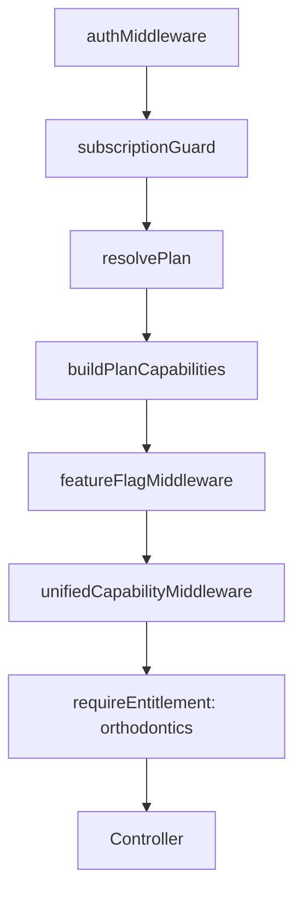
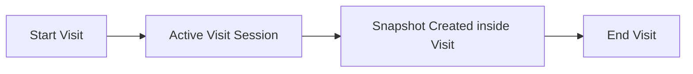
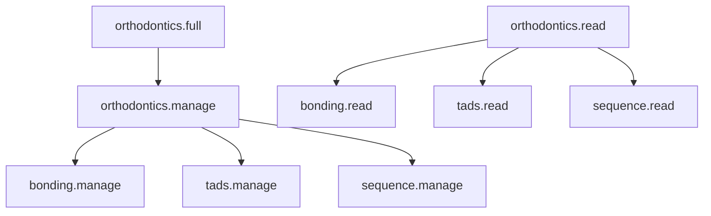

# ORTHODONTIC AI MODULE SPECIFICATION

**Document Type:** Technical Design Specification (TDS)
**Version:** 2.0 (Post Phase 30 + Entitlement Fix)
**Generated From:** Repository Audit — April 2026

## SECTION 1 — DOMAIN ARCHITECTURE (UPDATED)
Orthodontics is now a **Domain Module**, not a feature collection.

### Architecture Layers:
1. **Platform Plane**: `PlanVersion`, `OrgContract`, `Organization.currentContractId`
2. **Capability Layer (NEW)**: `req.capabilities.modules.orthodontics` — Derived from `entitlement` && `featureFlag`.
3. **RBAC Layer (SIMPLIFIED)**:
   - **Domain permissions**: `orthodontics.full`, `orthodontics.read`
   - **Engine permissions (internal only)**: `tads.manage`, `bonding.manage`, `sequence.manage`
   - *Note:* Controllers still use engine permissions; Roles ONLY use domain permissions.
4. **Application Layer**: Visit Session Engine, Snapshot Engine, Clinical Events Engine, AI Analysis Engine.
5. **UI Layer**: Orthodontic Overview Page, Visit-driven workflow (NOT chart-driven).

---

## SECTION 2 — ENTITLEMENT PIPELINE (FINAL)

### Request Flow

### Entitlement Rules
- NO BYPASS in production
- Missing plan → `403 PLAN_NOT_ASSIGNED`
- Missing module → `403 FEATURE_NOT_ENABLED`
- NEVER return `500` for entitlement failure

### Plan Resolution
`org.currentContractId` → `OrgContract.planVersionId` → `PlanVersion.modules.orthodonticsAdv` → `normalizeModules` → `orthodontics`

---

## SECTION 3 — VISIT-DRIVEN ARCHITECTURE (NEW CORE)
Orthodontic workflow is now **Visit-Centric**.

### Visit Lifecycle

### Rules
- Only ONE active visit per case (DB unique index).
- Snapshot REQUIRES valid active `visitId`.
- Snapshot locked if visit inactive.
- Auto-save snapshot on visit end.
- No empty visits allowed.

### Data Model
**VisitRecord:**
- `caseId`
- `status` (`active` | `completed` | `cancelled`)
- `visitNumber` (strictly increasing)
- `startedAt` / `endedAt`

**ClinicalSnapshot:**
- `visitId` (REQUIRED for treatment snapshots)
- `chartStateHash` (idempotency)
- Linked bidirectionally to VisitRecord

---

## SECTION 4 — SNAPSHOT ENGINE (UPDATED)

### Key Changes
- `visitId` enforcement (hard requirement)
- Idempotency via SHA-256 `chartStateHash`
- Duplicate prevention per visit
- Auto-save draft every 5s
- Snapshot cannot exist outside visit context

---

## SECTION 5 — RBAC MODEL (SIMPLIFIED)

**Design Principle:** *"Permissions represent business capability, not actions"*

### Hierarchical Resolution

### Rules
- Roles MUST NOT contain engine permissions.
- Controllers MUST NOT use domain permissions.
- `authorize()` resolves via hierarchy map.

---

## SECTION 6 — ORTHODONTIC ENGINES

All engines are sub-domains of Orthodontics:
- Visit Session Engine
- Snapshot Engine
- TAD Engine
- Bonding Engine
- Sequence Engine
- Clinical Event Engine
- **AI Analysis Engine** (Python PointNet++ infrastructure, geometry analysis, ML segmentations)

### Endpoint Security Contract
All routes MUST include:
`orgProtect` → `organizationContext` → `requireEntitlement("orthodontics")`

*Deprecated Flows:*
- ⚠️ `/api/v1/orthodontic-cases` without proper `orgProtect` or entitlement guards is strictly deprecated.
- ⚠️ Bypassing `ensureDiagnosticSnapshot` is deprecated.

---

## SECTION 7 — DATA INTEGRITY RULES (CRITICAL)

1. `Organization.currentContractId` MUST point to an ACTIVE contract.
2. If contract is missing or expired, it MUST NOT be used.
3. System must fallback to trial-tier OR return `403`.
4. Guardian checks enforce `ORG_CURRENT_CONTRACT_POINTER_INTEGRITY`.

---

## SECTION 8 — FAILURE MODES

| Scenario | Response |
|----------|----------|
| No contract | `403 PLAN_NOT_ASSIGNED` |
| Expired contract | `403 PLAN_INACTIVE` |
| No orthodontics module | `403 FEATURE_NOT_ENABLED` |
| No RBAC | `403 PERMISSION_DENIED` |

*Note:* NO silent fallback. NO `500` for business logic errors.

---

## SECTION 9 — UI ARCHITECTURE UPDATE

### Orthodontic Overview Page
- **OLD:** Chart Editor entry point ❌
- **NEW:** Visit-based entry point ✅

### UI Components
- Buttons: "Start Visit", "Continue Visit"
- Timeline: shows `VisitRecords` (NOT mock data)

### Interaction Flow
Click visit → open Visit Modal → open `SnapshotEditor` scoped to `visitId`

---

## SECTION 10 — TIMELINE SYSTEM

Timeline now represents: `VisitRecord[]`
Each item:
- `visitNumber`
- `status`
- `snapshot(s)`
- active indicator (live)

**Active visit UI:**
- Green pulse indicator
- "Continue Visit" CTA

---

## SECTION 11 — REMOVED CONCEPTS
- Chart Editor as standalone entry ❌
- Snapshot without visit ❌
- Bypass entitlement ❌
- Role-based engine permissions ❌

---

## SECTION 12 — PYTHON AI ENGINE (LEGACY SUPPLEMENT)
*(Retained from v1.0)*
The AI engine provides automated segmentation of 3D intraoral scans using PointNet++ models, clinical measurements (Bolton ratio), and landmark detection. It operates asynchronously and writes results back to `OrthodonticCase.lastToothAnalysis`.
